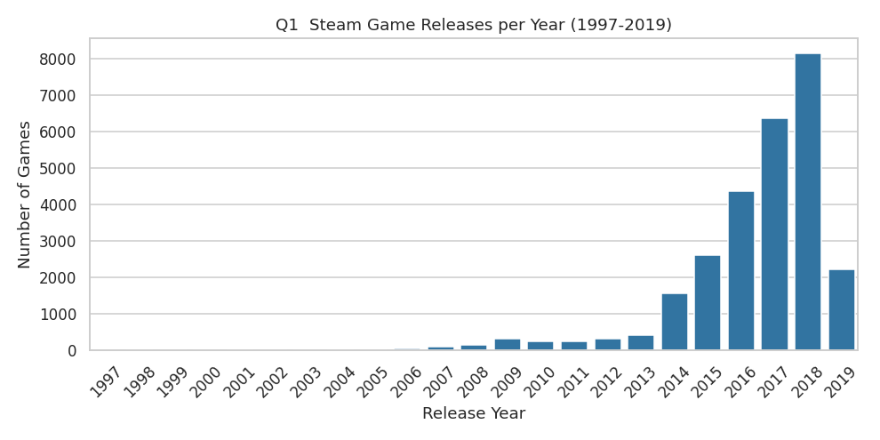
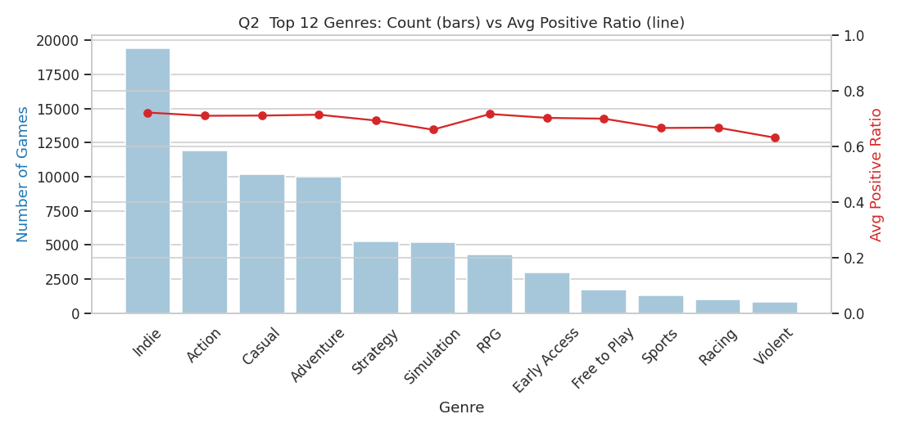
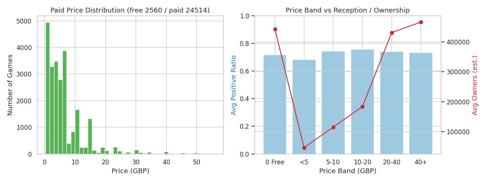
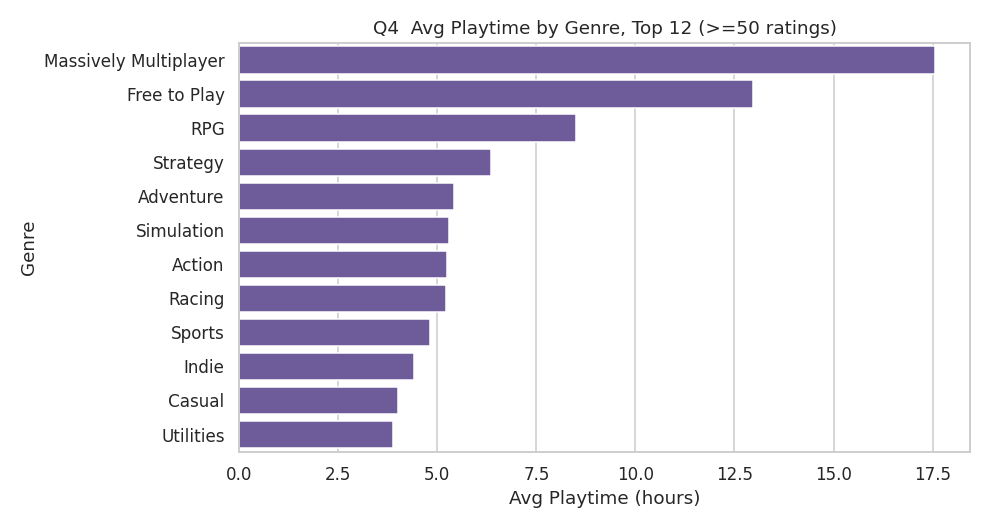
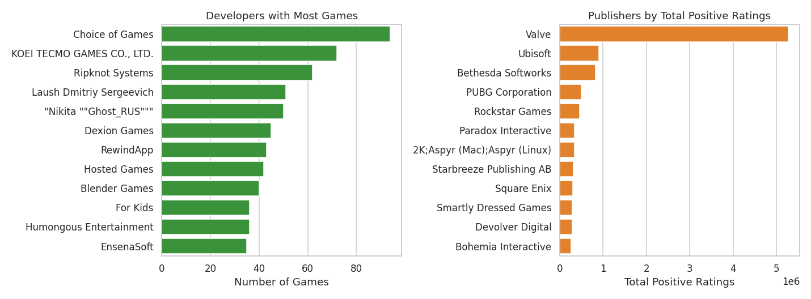
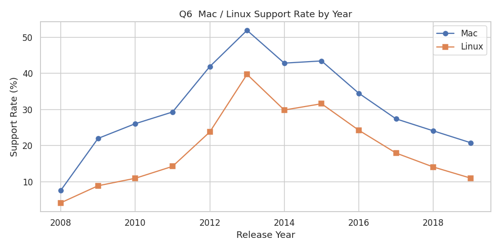
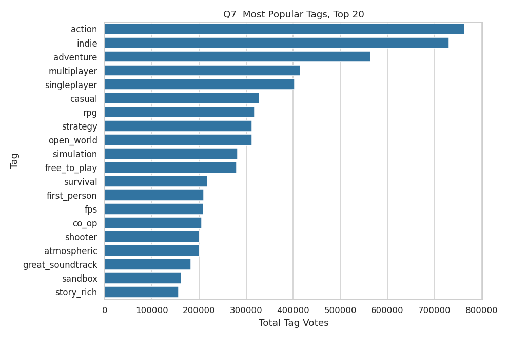
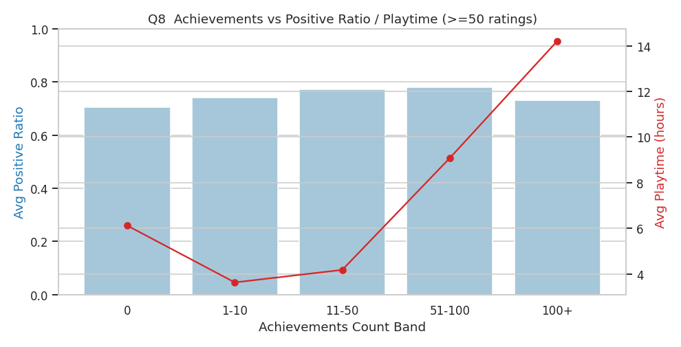

# Steam 游戏商店大数据分析报告

**课程**：大数据应用 · 期末项目  
**团队**：罗马（Roma）  
**成员**：罗景楠、马亦麟  
**代码仓库**：https://github.com/yilinpotato/BigData-App

---

## 1. 引言与数据集介绍

电子游戏是全球最大的数字娱乐产业之一，Steam 是 PC 平台最主要的游戏分发渠道。本项目对 Steam 商店约 2.7 万款游戏的结构化数据进行大数据分析，挖掘**市场结构、定价规律、用户粘性、平台战略**等方面的规律，完整演练 **HDFS 存储 → PySpark 清洗 → Spark SQL 分析 → 可视化** 的大数据处理流程。

数据集来自 Kaggle [Steam Store Games (Clean Dataset)](https://www.kaggle.com/datasets/nikdavis/steam-store-games/data)，由 SteamSpy 与 Steam Storefront API 抓取（2019 年快照），共 **6 个 CSV、约 242 MB**，以 `appid` 为主键关联：

| 文件 | 行数 | 内容 |
|---|---|---|
| `steam.csv` | 27,075 | 主表：名称、发行日期、开发/发行商、平台、类型、好评/差评数、游玩时长、拥有量、价格 |
| `steamspy_tag_data.csv` | 29,022 | 标签宽表（约 370 个标签列，值为投票数） |
| `steam_description_data.csv` | 174,903 | 游戏描述文本 |
| `steam_media_data.csv` | 27,332 | 图片/截图/视频链接（嵌套 JSON） |
| `steam_requirements_data.csv` | 27,319 | 配置要求（含 HTML） |
| `steam_support_info.csv` | 27,136 | 官网/客服链接 |

本报告的核心分析基于 `steam.csv`（主表）与 `steamspy_tag_data.csv`（标签）。

---

## 2. 系统架构与 HDFS 存储 / 访问策略

### 2.1 技术栈

| 层 | 组件 | 版本 |
|---|---|---|
| 存储 | Hadoop HDFS（单机伪分布式） | 3.3.6 |
| 计算 | Apache Spark / PySpark | 3.5.5 |
| 查询 | Spark SQL | 3.5.5 |
| 运行时 | OpenJDK | 17 (Temurin) |
| 可视化 | matplotlib / seaborn | — |

整个栈在 **WSL2 + Ubuntu 22.04** 上以**用户级、无需 root** 的方式部署。

### 2.2 HDFS 存储策略

采用**「原始区 + 清洗区」分层**的数据湖式组织：

```
hdfs:///steam/raw/      原始 CSV（不可变，留档）
hdfs:///steam/clean/    清洗后的列式数据
    ├── games/          主表，Parquet，按 release_year 分区
    └── tags_long/      标签长表，Parquet
```

设计要点：

- **原始/清洗分离**：原始 CSV 上传到 `/steam/raw` 后保持只读，所有加工产物写入 `/steam/clean`，保证可追溯、可重跑。
- **列式 + 压缩（Parquet）**：清洗后由行式 CSV 转为 **Parquet**，列式存储 + 内置压缩，显著降低分析时的 I/O，并保留 schema 与类型。
- **分区（Partitioning）**：主表按 `release_year` 分区，使「按年份」的查询能**分区裁剪（partition pruning）**，只扫描相关年份目录。
- **副本数=1**：单节点环境设 `dfs.replication=1`，避免无谓冗余。

### 2.3 访问方式与工程难点

- HDFS 守护进程以 `hdfs --daemon start namenode/datanode` 直接启动，**绕开 `start-dfs.sh` 对 SSH 免密登录的依赖**（WSL 下无 sshd），实现无 root 单机部署。
- Spark 通过 `spark.read.parquet("hdfs://localhost:9000/steam/clean/games")` 直接读 HDFS。
- 工程中解决了三个真实问题，并固化到脚本：① **Java 17 与 Hadoop 的模块访问限制**——为守护进程注入 `--add-opens`；② **工作目录含空格**导致 Hadoop FsShell 的本地路径 URI 解析失败——用硬链接把数据暴露到无空格目录再 `put`；③ Spark 本地落盘目录重定向到无空格路径。

> 全部启动脚本见仓库 `setup/`（`00_install_stack.sh` / `01_start_hdfs.sh` / `02_load_data.sh` / `env.sh`）。

---

## 3. 数据预处理（Spark 清洗管线）

清洗管线 `src/clean_pipeline.py` 从 HDFS 读原始 CSV，输出清洗后的 Parquet，关键步骤：

1. **类型转换**：`release_date → date`、评价数/时长 → 整型、`price → double`、布尔字段转换。
2. **派生字段**：
   - `positive_ratio = positive /(positive + negative)`（好评率）
   - `total_ratings`、`is_free`（价格为 0）
   - `owners_low / owners_high / owners_mid`：将拥有量区间字符串（如 `10000000-20000000`）解析为上下界与中位估计
   - `num_genres / num_categories / num_platforms` 及 `on_windows / on_mac / on_linux` 平台布尔
3. **多值字段处理**：`platforms / categories / genres / steamspy_tags` 以 `;` 分隔，分析时用 `explode` 展开。
4. **缺失值与异常处理**：过滤无 `appid` 或空 `name` 的记录、`appid` 去重、负价归零。
5. **宽表转长表**：标签宽表（约 370 列）用 Spark `stack()` 转为长表 `(appid, tag, votes)` 并过滤 `votes > 0`，由约 1,000 万稀疏单元压缩为 **215,633** 条有效记录。

清洗结果：主表 **27,075** 行（全部有效），整体平均好评率 **0.714**，免费游戏 **2,560** 款。

---

## 4. 分析问题、方法与发现

围绕 8 个分析问题，统一以 **Spark SQL / DataFrame API** 计算聚合结果，再用 matplotlib/seaborn 可视化。完整代码见 `notebooks/steam_analysis.ipynb`，SQL 见 `sql/analysis_queries.sql`。

### Q1 年度发行趋势
**方法**：按 `release_year` 分组计数（Spark SQL）。  
  
**发现**：发行量在 2014 年后爆发式增长，**2018 年达峰值 8,159 款**；**93%（25,242 款）的游戏在 2014 年及以后发行**。这与 Steam 2017 年开放 Steam Direct、独立游戏大量涌入直接相关；2019 因数据为年中快照而回落。

### Q2 热门类型及其口碑
**方法**：`explode(genres)` 后按类型聚合数量与平均好评率。  
  
**发现**：**Indie（19,419）、Action（11,903）、Casual（10,210）、Adventure（10,031）** 数量领先。但**数量多不等于口碑好**——各类型平均好评率集中在 0.63–0.73，休闲/竞速/暴力类略低，核心向类型相对更稳。

### Q3 价格 × 口碑 × 拥有量
**方法**：价格分桶后聚合平均好评率与平均拥有量；并统计免费/付费占比。  
  
**发现**：付费游戏中位价仅 **£3.99**，定价高度集中于低价区。关键反差：**最低价区（<£5，13,285 款）平均好评率最低（0.684）、平均拥有量也最低（约 4.7 万）**，是典型的"走量但偏低质"长尾；而 **£10–40 中端**游戏好评率最高（约 0.75），**免费游戏与中高价精品**则拥有量最大（免费约 44 万）。即"**低价不等于走量，免费与精品才走量**"。

### Q4 游玩时长 × 类型（用户粘性）
**方法**：在有一定评价量的样本上，按类型聚合平均游玩时长。  
  
**发现**：**大型多人（MMO，约 17.6 小时）、免费网游（13 小时）、RPG（8.5 小时）、策略（6.3 小时）** 粘性最强。强粘性高度依赖**可重复游玩机制**（多人对战、长期养成/经营），休闲解谜类时长最短。

### Q5 Top 开发商 / 发行商
**方法**：按开发商计数；按发行商累计好评数排序（Spark SQL）。  
  
**发现**：发行**数量**最多的是量产型工作室（Choice of Games 94 款、KOEI TECMO 72 款）；而累计**口碑**高度集中于头部发行商——**Valve（527 万好评）** 一骑绝尘，其后为育碧、Bethesda、PUBG、Rockstar。**数量与影响力并不等同**：头部靠少数爆款贡献了绝大多数正面评价。

### Q6 平台支持趋势
**方法**：统计整体平台占比，及 Mac/Linux 支持率随年份变化。  
  
**发现**：Windows 支持率 **100%**，Mac **29.8%**、Linux **19.3%**。Mac/Linux 支持率在 **2013–2015 年（SteamOS / Steam Machine 推广期）见顶**，随该战略降温而回落——**平台覆盖与厂商商业战略强相关**。

### Q7 最受欢迎标签
**方法**：在标签长表上按 `tag` 汇总投票数（Spark SQL）。  
  
**发现**：投票最高的标签为 **action（76.4 万）、indie（73.0 万）、adventure、multiplayer、singleplayer**，与 Q2 的类型分布互相印证；玩家心智中的标签更偏"玩法体验"（如 singleplayer、atmospheric）。

### Q8 成就数量 × 口碑 / 时长
**方法**：按成就数量分桶，比较平均好评率与平均时长。  
  
**发现**：**有成就的游戏好评率（0.74–0.78）整体高于无成就（0.704）**，并在 **51–100 个成就**时好评率最高（0.779）；游玩时长随成就数单调上升（100+ 成就达 14.2 小时）。说明成就作为**正反馈/留存机制**与满意度、粘性正相关，但数量过多边际收益递减。

---

## 5. 结论

1. **市场结构**：Steam 自 2014 年起进入独立游戏井喷期，Indie/Action/Casual 在数量上主导，但同质化也压低了长尾产品的口碑。
2. **商业规律**：定价集中于低价区，但**低价 ≠ 走量**——<£5 多为低质长尾，免费与中高价精品才同时获得高拥有量；中端定价口碑最佳。
3. **用户粘性**：多人 / 网游 / RPG / 策略类时长最长，粘性源于可重复游玩与长期养成机制。
4. **平台与机制**：跨平台支持随厂商战略（SteamOS）起落；成就系统与玩家满意度、留存正相关。

## 6. 反思与局限

- 数据为 **2019 年快照**，无法反映近年趋势；`owners` 为区间估计、`price` 为英镑计价，分析结论偏宏观。
- 缺少**真实文本评论**，好评率只能由 positive/negative 计数近似，无法做情感细分。
- 未深入解析 `description / requirements` 中的文本与 HTML 字段。**后续可**：解析描述做 NLP 主题/情感分析、引入时间序列建模、用标签共现做社区/聚类分析。
- 工程上单机 HDFS 仅作教学演示，真实场景应为多节点集群并引入 Hive/数据治理。

## 7. 团队分工

| 成员 | 主要分工 |
|---|---|
| 罗景楠 | 数据工程：HDFS 环境搭建、数据入库、Spark 清洗管线（`setup/`、`src/clean_pipeline.py`） |
| 马亦麟 | 分析与可视化：8 个分析问题的 Spark SQL、图表与解读（`notebooks/`、`sql/`） |
| 共同 | 报告撰写、结果验证与演示 |

> （以上分工为初稿，可按实际贡献调整。）

---

## 附录：环境与复现

```bash
git clone https://github.com/yilinpotato/BigData-App.git
cd BigData-App
bash setup/00_install_stack.sh   # 安装 Hadoop（首次）
bash setup/01_start_hdfs.sh      # 启动单机 HDFS
bash setup/02_load_data.sh       # CSV 入 HDFS
source setup/env.sh
python src/clean_pipeline.py     # 清洗 → Parquet
# 打开 notebooks/steam_analysis.ipynb 运行分析
```
