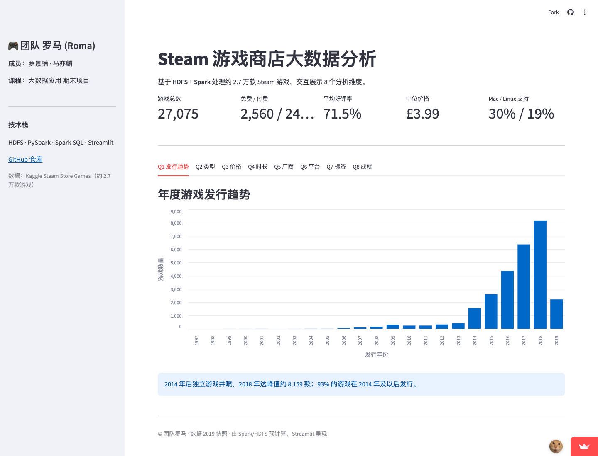
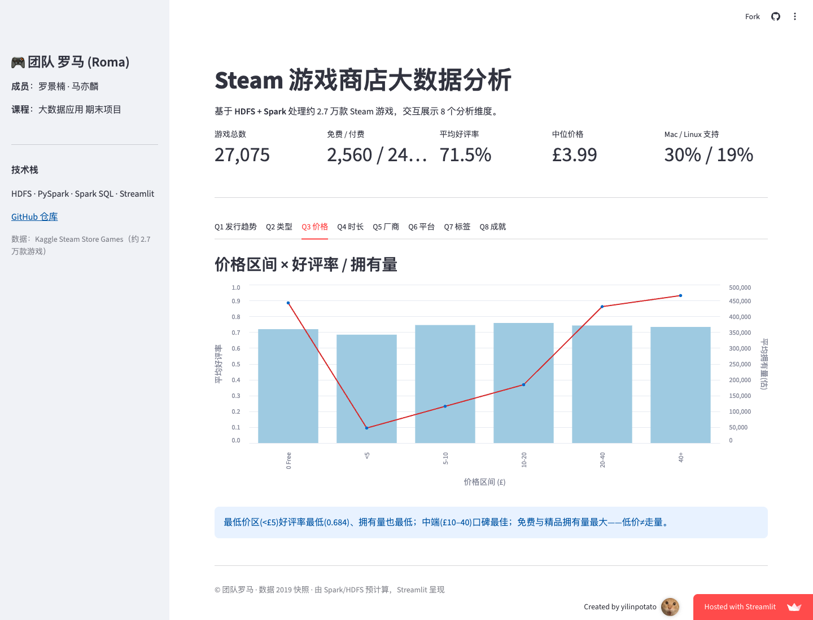

# Steam Store Big Data Analysis Report

**Course**: Big Data Application - Final Project  
**Team**: Roma  
**Members**: Luo Jingnan, Ma Yilin  
**Repository**: https://github.com/yilinpotato/BigData-App

---

## 0. Submission Package and Grading Focus

The final submission should include the following artifacts:

| Item | What to Submit | Purpose |
|---|---|---|
| Project repository | GitHub repository: https://github.com/yilinpotato/BigData-App | Complete source code, scripts, SQL, notebook, figures, report, and dashboard files |
| Final report | `report/report_en.pdf` | Main written deliverable for the report rubric |
| Executable analysis | `notebooks/steam_analysis.ipynb`, `src/*.py` | Reproducible Spark/HDFS cleaning and analysis workflow |
| SQL / HiveQL | `sql/analysis_queries.sql`, `sql/hive_setup.hql` | Evidence of structured analytical queries and Hive warehouse usage |
| Visual outputs | `figures/*.png` and dashboard screenshots | Static and interactive evidence for findings |
| Dashboard bonus | https://bigdata-app-nckiksi6ebas3bxbgdr5m9.streamlit.app/ | Optional extended implementation for extra credit |

The grading rubric has two main parts:

- **Project report (50 points)**: dataset introduction, HDFS storage/access strategy, preprocessing, analytical questions and methods, findings, visualizations, conclusion/reflection, coherence, presentation quality, and team roles.
- **Source code (50 points)**: executable notebook or scripts, Spark/HDFS data loading and cleaning pipeline, correct use of Spark/HDFS tools, code quality and comments, SQL/HiveQL where applicable, methodological depth, completeness of results, and demonstration quality.
- **Optional bonus (up to 10 points)**: extended implementation such as a dashboard or web interface. This project provides a Streamlit dashboard with eight interactive analysis tabs.

---

## 1. Introduction and Dataset

Video games are one of the largest digital entertainment industries in the world, and Steam is the dominant distribution platform for PC games. This project analyzes structured data for about 27,000 games on the Steam store, focusing on **market structure, pricing patterns, user engagement, and platform strategy**. It implements a complete big data workflow: **HDFS storage -> PySpark cleaning -> Spark SQL / HiveQL analysis -> visualization -> interactive dashboard presentation**. The final deliverables include executable scripts, a completed notebook, SQL/HiveQL queries, eight visualization figures, a PDF report, and a Streamlit dashboard.

The dataset is from Kaggle [Steam Store Games (Clean Dataset)](https://www.kaggle.com/datasets/nikdavis/steam-store-games/data). It was collected from SteamSpy and the Steam Storefront API as a 2019 snapshot. It contains **6 CSV files, about 242 MB in total**, linked by the primary key `appid`:

| File | Rows | Description |
|---|---:|---|
| `steam.csv` | 27,075 | Main table: name, release date, developer/publisher, platforms, genres, positive/negative ratings, playtime, estimated owners, and price |
| `steamspy_tag_data.csv` | 29,022 | Wide tag table with about 370 tag columns; values are user votes |
| `steam_description_data.csv` | 174,903 | Game description text |
| `steam_media_data.csv` | 27,332 | Header images, screenshots, and video links stored as nested JSON-like fields |
| `steam_requirements_data.csv` | 27,319 | System requirements, including HTML content |
| `steam_support_info.csv` | 27,136 | Official website and support links |

The core analysis in this report is based on `steam.csv` as the main game table and `steamspy_tag_data.csv` as the tag table.

---

## 2. System Architecture and HDFS Storage / Access Strategy

### 2.1 Technology Stack

| Layer | Component | Version |
|---|---|---|
| Storage | Hadoop HDFS, pseudo-distributed single-node mode | 3.3.6 |
| Processing | Apache Spark / PySpark | 3.5.5 |
| Query | Spark SQL | 3.5.5 |
| Warehouse | Hive Metastore / HiveQL through Spark Hive Support | Integrated with Spark 3.5.5 |
| Runtime | OpenJDK | 17 (Temurin) |
| Visualization | matplotlib / seaborn | - |
| Presentation | Streamlit / Altair | Dashboard bonus implementation |

The stack is deployed on **WSL2 + Ubuntu 22.04** in user space without requiring root privileges.

### 2.2 HDFS Storage Strategy

The project uses a two-layer data lake layout with a **raw zone** and a **clean zone**:

```text
hdfs:///steam/raw/      Raw CSV files, immutable archival copy
hdfs:///steam/clean/    Cleaned columnar data
    |-- games/          Main table, Parquet, partitioned by release_year
    |-- tags_long/      Long-form tag table, Parquet
```

Key design choices:

- **Separation of raw and clean data**: Raw CSV files are uploaded to `/steam/raw` and kept read-only. All processed outputs are written to `/steam/clean`, which makes the pipeline traceable and rerunnable.
- **Columnar storage with compression**: Cleaned data is converted from row-oriented CSV into **Parquet**, reducing analytical I/O while preserving schema and data types.
- **Partitioning**: The main game table is partitioned by `release_year`, so year-based queries can benefit from partition pruning and avoid scanning unrelated directories.
- **Replication factor = 1**: In the single-node teaching environment, `dfs.replication=1` avoids unnecessary replication overhead.

### 2.3 Access Method and Engineering Challenges

- HDFS daemons are started directly with `hdfs --daemon start namenode/datanode`, avoiding the SSH passwordless-login dependency of `start-dfs.sh`, which is inconvenient in the WSL environment.
- Spark reads cleaned data directly from HDFS, for example `spark.read.parquet("hdfs://localhost:9000/steam/clean/games")`.
- Three practical issues were solved and documented in scripts: (1) **Java 17 module access restrictions in Hadoop**, handled by injecting `--add-opens`; (2) **local paths containing spaces** causing Hadoop FsShell URI parsing failures, handled by exposing the data through a no-space path before `put`; (3) redirecting Spark local temporary directories to a path without spaces.

All startup scripts are provided in `setup/`: `00_install_stack.sh`, `01_start_hdfs.sh`, `02_load_data.sh`, and `env.sh`.

### 2.4 Hive Warehouse and Interactive Presentation

On top of the Spark cleaning layer, the project adds two extensions: a Hive warehouse and an interactive dashboard.

- **Hive warehouse**: `src/hive_warehouse.py` enables `enableHiveSupport()`, materializes the cleaned Parquet table to `hdfs:///steam/warehouse/games`, and creates two external tables, `steam.games` and `steam.tags_long`. `sql/hive_setup.hql` provides database creation, table creation, and three HiveQL queries covering release trends, price tiers, and popular tags. This shows that the cleaned data can be reused through a SQL warehouse interface.
- **Streamlit dashboard**: `src/export_dashboard_data.py` uses Spark to precompute aggregated results for the eight analytical questions and exports them to `app/data/*.csv`. `app/dashboard.py` only depends on pandas, Streamlit, and Altair at runtime, so it can be deployed without HDFS or Spark. The dashboard includes overview metrics and eight interactive analysis tabs, serving as an extended implementation and demonstration bonus.

### 2.5 Dashboard Visual Evidence

The deployed dashboard presents the same Spark-computed results in an interactive form. It includes five overview metrics and eight tabs corresponding to the eight analytical questions.



The price tab uses a dual-axis interactive chart: bars show average positive ratio by price tier, while the line shows estimated average owners. This makes the "low price does not equal high ownership" finding easier to inspect during the project demonstration.



---

## 3. Data Preprocessing with Spark

The cleaning pipeline `src/clean_pipeline.py` reads raw CSV files from HDFS and writes cleaned Parquet outputs. The key steps are:

1. **Type conversion**: Convert `release_date -> date`, rating and playtime fields -> integers, `price -> double`, and platform flags -> booleans.
2. **Derived fields**:
   - `positive_ratio = positive / (positive + negative)`, used as the positive review ratio.
   - `total_ratings` and `is_free`.
   - `owners_low / owners_high / owners_mid`, parsed from owner-range strings such as `10000000-20000000`.
   - `num_genres / num_categories / num_platforms`, plus `on_windows / on_mac / on_linux`.
3. **Multi-value fields**: Fields such as `platforms`, `categories`, `genres`, and `steamspy_tags` are separated by `;`; analysis expands them with `explode`.
4. **Missing and abnormal values**: Rows without `appid` or valid `name` are filtered out, duplicates are removed by `appid`, and negative prices are reset to zero.
5. **Wide-to-long tag conversion**: The tag table, which has about 370 sparse tag columns, is transformed with Spark `stack()` into a long table `(appid, tag, votes)`, keeping only `votes > 0`. This compresses roughly 10 million sparse cells into **215,633** effective tag records.

After cleaning, the main table contains **27,075** valid games. The overall average positive ratio is **0.714**, and there are **2,560** free games.

### 3.1 Key Cleaning Code

The following code excerpt shows how the pipeline converts raw string fields into typed analytical fields and derives review, price, owner, and platform indicators:

```python
g = (raw
    .withColumn("appid", F.col("appid").cast(T.IntegerType()))
    .withColumn("release_date", F.to_date("release_date", "yyyy-MM-dd"))
    .withColumn("price", F.col("price").cast(T.DoubleType()))
    .withColumn("release_year", F.year("release_date"))
    .withColumn("total_ratings", F.col("positive_ratings") + F.col("negative_ratings"))
    .withColumn(
        "positive_ratio",
        F.when(F.col("total_ratings") > 0,
               F.col("positive_ratings") / F.col("total_ratings"))
    )
    .withColumn("is_free", F.col("price") == 0)
    .withColumn("owners_low", F.split("owners", "-").getItem(0).cast(T.LongType()))
    .withColumn("owners_high", F.split("owners", "-").getItem(1).cast(T.LongType()))
    .withColumn("owners_mid", ((F.col("owners_low") + F.col("owners_high")) / 2).cast(T.LongType()))
    .withColumn("on_windows", F.col("platforms").contains("windows"))
    .withColumn("on_mac", F.col("platforms").contains("mac"))
    .withColumn("on_linux", F.col("platforms").contains("linux")))
```

The tag table is originally a sparse wide table. Spark `stack()` is used to transform it into a compact long table, which is easier to aggregate with SQL:

```python
tag_cols = [c for c in tags.columns if c != "appid"]
pairs = ", ".join([f"'{c}', `{c}`" for c in tag_cols])
stack_expr = f"stack({len(tag_cols)}, {pairs}) as (tag, votes)"
tags_long = (tags.select(F.col("appid").cast(T.IntegerType()), F.expr(stack_expr))
                  .withColumn("votes", F.col("votes").cast(T.IntegerType()))
                  .filter(F.col("votes") > 0))
```

---

## 4. Analytical Questions, Methods, and Findings

The project studies eight analytical questions. Results are computed with **Spark SQL / DataFrame API** and visualized with matplotlib/seaborn. The core queries are also organized in `sql/analysis_queries.sql`, and selected queries are reproduced through Hive external tables in `sql/hive_setup.hql`. The full analysis is available in the executed `notebooks/steam_analysis.ipynb` and the exported `src/steam_analysis.py`.

### 4.1 Key Query and Visualization Code

The price analysis is implemented with Spark SQL price buckets. The same result is exported to the dashboard, where Altair renders it as a dual-axis chart:

```sql
SELECT CASE
         WHEN price = 0 THEN '0 Free'
         WHEN price < 5 THEN '<5'
         WHEN price < 10 THEN '5-10'
         WHEN price < 20 THEN '10-20'
         WHEN price < 40 THEN '20-40'
         ELSE '40+' END AS price_band,
       COUNT(*) AS n,
       ROUND(AVG(positive_ratio), 3) AS avg_ratio,
       ROUND(AVG(owners_mid), 0) AS avg_owners
FROM games
GROUP BY price_band;
```

```python
base = alt.Chart(d).encode(x=alt.X("price_band:N", sort=order))
bar = base.mark_bar(color="#9ecae1").encode(y="avg_ratio:Q")
line = base.mark_line(point=True, color="#d62728").encode(y="avg_owners:Q")
st.altair_chart(alt.layer(bar, line).resolve_scale(y="independent"),
                width="stretch")
```

### Q1. Annual Release Trend

**Method**: Group games by `release_year` and count releases with Spark SQL.  
  
**Finding**: Steam releases grew explosively after 2014 and reached a peak of **8,159 games in 2018**. **93% of games, or 25,242 titles, were released in 2014 or later**. This aligns with the rise of indie games and Steam Direct; the 2019 drop is mainly because the dataset is a mid-year snapshot.

### Q2. Popular Genres and Reception

**Method**: Split and `explode(genres)`, then aggregate count and average positive ratio by genre.  
  
**Finding**: **Indie (19,419), Action (11,903), Casual (10,210), and Adventure (10,031)** are the largest genres. However, a larger number of games does not imply better reception. Average positive ratios mostly fall between 0.63 and 0.73, with casual/racing/violent categories slightly lower and more core-oriented genres more stable.

### Q3. Price, Reception, and Estimated Ownership

**Method**: Bucket prices and aggregate average positive ratio and estimated average owners; also compare free and paid games.  
  
**Finding**: The median paid-game price is only **GBP 3.99**, showing a strong concentration in low-price tiers. The lowest paid tier, **under GBP 5 with 13,285 games**, has the lowest average positive ratio (**0.684**) and low average ownership (about **47,000**), representing a long tail of low-quality low-price products. In contrast, **GBP 10-40 mid-priced games** have the highest reception, while **free games and higher-quality premium games** achieve the largest ownership. In short, low price does not automatically create scale; free access and quality products do.

### Q4. Playtime and Genre Engagement

**Method**: For games with sufficient ratings, aggregate average playtime by genre.  
  
**Finding**: **Massively Multiplayer (about 17.6 hours), Free to Play (13 hours), RPG (8.5 hours), and Strategy (6.3 hours)** show the strongest engagement. High engagement is closely related to replayable systems such as multiplayer competition, long-term progression, and management loops, while casual and puzzle games have shorter playtime.

### Q5. Top Developers and Publishers

**Method**: Count games by developer and rank publishers by total positive ratings with Spark SQL.  
  
**Finding**: The developers with the most releases are production-heavy studios such as Choice of Games with 94 titles and KOEI TECMO with 72 titles. However, total positive ratings are highly concentrated among top publishers. **Valve leads with 5.27 million positive ratings**, followed by Ubisoft, Bethesda, PUBG, and Rockstar. Quantity and influence are different: a few hit games contribute most of the positive feedback.

### Q6. Platform Support Trend

**Method**: Compute overall Windows/Mac/Linux support rates and yearly Mac/Linux support rates.  
  
**Finding**: Windows support is essentially **100%**, while Mac support is **29.8%** and Linux support is **19.3%**. Mac/Linux support peaked around **2013-2015**, the SteamOS / Steam Machine promotion period, and then declined. Platform coverage is strongly connected to vendor strategy.

### Q7. Most Popular Tags

**Method**: Aggregate `votes` by `tag` from the long-form tag table with Spark SQL.  
  
**Finding**: The most voted tags are **action (764k), indie (730k), adventure, multiplayer, and singleplayer**. These tags support the genre findings from Q2, while also showing that player perception is often framed around gameplay experience, such as singleplayer and atmospheric.

### Q8. Achievements, Reception, and Playtime

**Method**: Bucket games by achievement count and compare average positive ratio and average playtime.  
  
**Finding**: Games with achievements have higher positive ratios (**0.74-0.78**) than games without achievements (**0.704**), and the **51-100 achievement** bucket has the highest positive ratio (**0.779**). Playtime increases monotonically with achievement count, reaching **14.2 hours** for games with more than 100 achievements. Achievements appear to be positively associated with feedback and retention, though excessive achievement counts may have diminishing returns.

---

## 5. Conclusion

1. **Market structure**: Steam entered an indie-game boom after 2014. Indie, Action, and Casual dominate by quantity, but market saturation also lowers the reception of long-tail products.
2. **Business pattern**: Pricing is concentrated in low-price tiers, but low price does not equal high ownership. The under-GBP-5 tier is often a low-quality long tail, while free games and higher-quality premium products attract larger audiences. Mid-priced games achieve the best reception.
3. **User engagement**: Multiplayer, online, RPG, and strategy games have the longest playtime, driven by replayability and long-term progression systems.
4. **Platform and mechanics**: Cross-platform support rises and falls with vendor strategy such as SteamOS, while achievement systems are positively related to satisfaction and retention.
5. **Engineering value**: The project forms a reproducible data application pipeline through HDFS raw/clean layering, Parquet partitioning, Spark SQL aggregation, Hive external tables, and a precomputed dashboard, rather than stopping at offline charts.

## 6. Reflection and Limitations

- The dataset is a **2019 snapshot**, so it cannot reflect recent trends. `owners` is an interval estimate and `price` is recorded in GBP, so conclusions are macro-level rather than exact.
- The dataset lacks **real review text**. The positive ratio is approximated by positive/negative rating counts, so it cannot support fine-grained sentiment analysis.
- Text and HTML fields in `description` and `requirements` were not deeply parsed. Future work could apply NLP topic or sentiment analysis, build time-series models, and use tag co-occurrence for community detection or clustering.
- The single-node HDFS setup is mainly for teaching and demonstration. In a real production setting, it should be extended to a multi-node cluster with scheduling, access control, metadata governance, and data-quality monitoring.

## 7. Team Roles

| Member | Main Responsibilities |
|---|---|
| Luo Jingnan | Data engineering and reproducibility: HDFS setup, data loading, Spark cleaning pipeline, and Hive warehouse validation (`setup/`, `src/clean_pipeline.py`, `src/hive_warehouse.py`) |
| Ma Yilin | Analysis and presentation: Spark SQL for eight analytical questions, figures and interpretation, and Streamlit dashboard (`notebooks/`, `sql/`, `app/`) |
| Joint work | Report writing, result validation, demo preparation, and GitHub delivery |

---

## 8. Rubric Mapping

| Rubric Requirement | Project Deliverable |
|---|---|
| Dataset introduction | Section 1; `dataset/README.md` |
| HDFS storage and access strategy | Section 2; `setup/`; `src/common.py` |
| Cleaning, parsing, and missing-value handling | Section 3; `src/clean_pipeline.py` |
| Spark / Hive / SQL analytical methods | Section 4; `notebooks/steam_analysis.ipynb`; `sql/analysis_queries.sql`; `sql/hive_setup.hql` |
| Key findings and interpretation | Sections 4-5, with data-backed conclusions for all eight questions |
| Visualizations and explanations | Eight figures in `figures/`; dashboard screenshots in Section 2.5; Section 4; `app/dashboard.py` |
| Conclusion and reflection | Sections 5-6 |
| Complete executable code and extended implementation | `src/*.py`, `notebooks/`, `sql/`, and `app/`; Streamlit dashboard as the bonus component |

---

## Appendix: Environment and Reproduction

```bash
git clone https://github.com/yilinpotato/BigData-App.git
cd BigData-App
bash setup/00_install_stack.sh   # Install Hadoop, first run only
bash setup/01_start_hdfs.sh      # Start single-node HDFS
bash setup/02_load_data.sh       # Upload CSV files to HDFS
source setup/env.sh
python src/clean_pipeline.py     # Clean data -> Parquet
# Open notebooks/steam_analysis.ipynb and run the analysis
python src/hive_warehouse.py     # Optional: create Hive external tables and run HiveQL
python src/export_dashboard_data.py
streamlit run app/dashboard.py   # Optional: start the interactive dashboard
```
